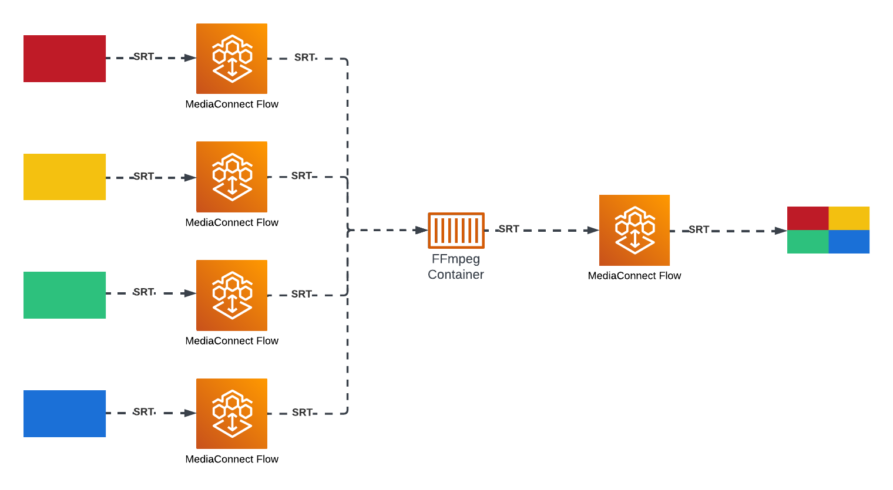

### AWS MediaConnect Multiviewer

A multiviewer for AWS MediaConnect flows. Companion blog post [here](https://blog.kilpatrick.cloud/posts/mediaconnect-multiviewer/).

This repository is a proof-of-concept for live video mixing for MediaConnect flows using AWS ECS containers. In this case, four MediaConnect streams are mixed by an FFmpeg container to produce a 4-panel video stream.



The same architecture is capable of supporting any type of live video mixing. With a tool like [FFmpeg](https://ffmpeg.org/) or [GStreamer](https://gstreamer.freedesktop.org/), many types of video filters and transformations can be applied to any number of inputs and outputs.

#### Infrastructure
- 5x MediaConnect Flow (4 sources, 1 output)
- Public VPC (VPC, Subnet, Internet Gateway, etc.)
- ECS Cluster
- 4x Source ECS Service
- 1x Video Mixer ECS Service

#### Deployment

Clone the repo and install dependencies,

```shell
$ git clone https://github.com/joeykilpatrick/aws-mediaconnect-multiviewer.git
$ cd aws-mediaconnect-multiviewer
$ npm i
```

All infrastructure is deployed with the AWS CDK. Environment variables `ACCOUNT_ID` and `REGION` must be set for deployment. They can be specified in-line like this:
```shell
$ ACCOUNT_ID=123456789012 REGION=us-east-1 npm run deploy
```
For Windows, the `cross-env` package can be used.
```shell
$ npm i -g cross-env
$ cross-env ACCOUNT_ID=123456789012 REGION=us-east-1 npm run deploy
```

After deployment is complete, a CloudFormation export called `multiviewerOutputUrl` will be displayed. It should look something like this:

```text
...
Outputs:
aws-mediaconnect-multiviewer.multiviewerOutputUrl = srt://XXX.XXX.XXX.XXX:3001
Stack ARN:
...
```

The output of the multiviewer stream can be viewed using this SRT URL. If you have FFmpeg installed, you can do
```shell
$ ffplay -i srt://XXX.XXX.XXX.XXX:3001
```

*In may take a few minutes for the output to be viewable as all of the containers are initialized and begin streaming.*

To tear down all resources,

```shell
$ ACCOUNT_ID=123456789012 REGION=us-east-1 npm run destroy
```
